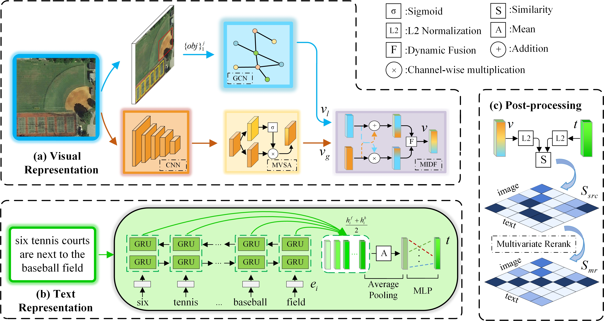
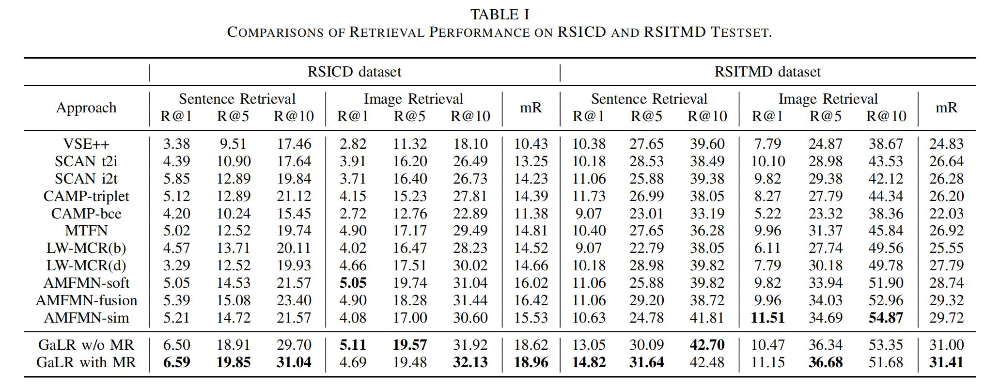

## The offical PyTorch code for paper ["Remote Sensing Cross-Modal Text-Image Retrieval Based on Global and Local Information", TGRS 2022.](https://doi.org/10.1109/TGRS.2022.3163706)

# GaLR
##### Author: Zhiqiang Yuan 

<a href="https://github.com/xiaoyuan1996/retrievalSystem"></a>


<a href="https://pypi.org/project/mitype/"></a>

### -------------------------------------------------------------------------------------
### Welcome :+1:_<big>`Fork and Star`</big>_:+1:, then we'll let you know when we update

```bash
#### News:
#### 2021.9.26: ---->Under update ...<----
```
### -------------------------------------------------------------------------------------

## INTRODUCTION
This is GaLR, a cross-modal retrieval method for remote sensing images.
We use the MIDF module to fuse multi-level RS image features, and add the DREA mechanism to improve the performance of local features.
In addition, a multivariate rerank algorithm is designed to make full use of the information in the similarity matrix during the testing.
Our method has achieved the state-of-the-art performance (2021.10) in RS cross-modal retrieval task on multiple RS image-text datasets.

### Network Architecture

The proposed RSCTIR framework based on global and local information. Compared with the retrieval models constructed using only global features, GaLR incorporates optimized local features in the visual encoding considering the target redundancy of RS. The multi-level information dynamic fusion module is designed to fuse the two types of information, using the global information to supplement the local information and utilizing the latter to correct the former. The suggested multivariate rerank algorithm as a post-processing method further improves the retrieval accuracy without extra training.

### DREA
To alleviate the pressure on the model from redundant target relations and increase the model’s focus on salient instances, we come up with a denoised representation matrix and a enhanced adjacency matrix to assist the GCN in producing better local representations. 
DREA filters the redundant features with high similarity and enhances the features of salient targets, which enables GaLR to obtain more transcendent visual representation.

### MIDF

The proposed multi-level information dynamic fusion module. The method falls into two stages of feature retransformation and dynamic fusion. MIDF first uses SA and GA modules to retransform features, then uses global information to supplement local information and leverages the latter to correct the former. Further dynamic fusion of multi-level features is accomplished through the fabricated dynamic fusion module.

### Multivariate Rerank

The proposed multivariate rerank algorithm. In order to make full use of the similarity matrix, we use k candidates for reverse search and to optimize the similarity results by considering multiple ranking factors. The figure shows an illustration of multivariate rerank when k = 3, using image i for retrieval.

### Performance

Comparisons of Retrieval Performance on RSICD and RSITMD Testset.
### -------------------------------------------------------------------------------------
## IMPLEMENTATION

```bash
Installation

We recommended the following dependencies:
Python 3
PyTorch > 0.3
Numpy
h5py
nltk
yaml
```

```bash
file structure:
-- checkpoint    # savepath of ckpt and logs

-- data          # soorted anns of four datesets
    -- rsicd_precomp
        -- train_caps.txt     # train anns
        -- train_filename.txt # corresponding imgs
        -- test_caps.txt      # test anns
        -- test_filename.txt  # corresponding imgs
        -- images             # rsicd images here
    -- rsitmd_precomp
        ...

-- exec         # .sh file

-- layers        # models define

-- logs          # tensorboard save file

-- option        # different config for different datasets and models

-- util          # some script for data processing

-- vocab         # vocabs for different datasets

-- seq2vec       # some files about seq2vec
    -- bi_skip.npz
    -- bi_skip.npz.pkl
    -- btable.npy
    -- dictionary.txt
    -- uni_skip.npz
    -- uni_skip.npz.pkl
    -- utable.npy

-- postprocessing # multivariate rerank
    -- rerank.py
    -- file

-- data.py       # load data
-- engine.py     # details about train and val
-- test.py       # test k-fold answers
-- test_single.py    # test one model
-- train.py      # main file
-- utils.py      # some tools
-- vocab.py      # generate vocab

Note:
1. In order to facilitate reproduction, we have provided processed annotations.
2. We prepare some used file::
  (1)[seq2vec (Password:NIST)](https://pan.baidu.com/s/1FOPldSGO6ctETiXMlPGC8g)
  (2)[RSICD images (Password:NIST)](https://pan.baidu.com/s/1lH5m047P9m2IvoZMPsoDsQ)
```

```bash
Run: (We take the dataset RSITMD as an example)
Step1:
    Put the images of different datasets in ./data/{dataset}_precomp/images/

    --data
        --rsitmd_precomp
        -- train_caps.txt     # train anns
        -- train_filename.txt # corresponding imgs
        -- test_caps.txt      # test anns
        -- test_filename.txt  # corresponding imgs
        -- images             # images here
            --img1.jpg
            --img2.jpg
            ...

Step2:
    Modify the corresponding yaml in ./options.

    Regard RSITMD_AMFMN.yaml as opt, which you need to change is:
        opt['dataset']['data_path']  # change to precomp path
        opt['dataset']['image_path']  # change to image path
        opt['model']['seq2vec']['dir_st'] # some files about seq2vec

Step3:
    Bash the ./sh in ./exec.
    Note the GPU define in specific .sh file.

    cd exec/RSICD
    bash run_GaLR_rsicd.sh

Note: We use k-fold verity to do a fair compare. Other details please see the code itself.
```

## Citation
If you feel this code helpful or use this code or dataset, please cite it as
```
Z. Yuan et al., "Remote Sensing Cross-Modal Text-Image Retrieval Based on Global and Local Information," in IEEE Transactions on Geoscience and Remote Sensing, doi: 10.1109/TGRS.2022.3163706.
```
